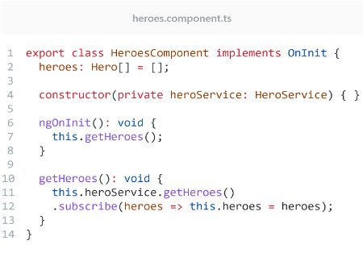
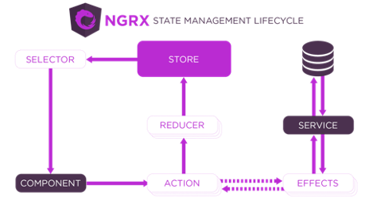
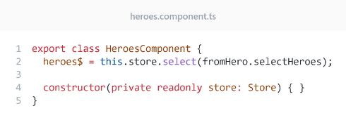
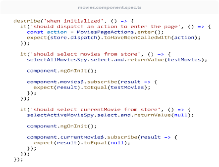
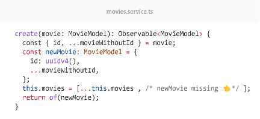
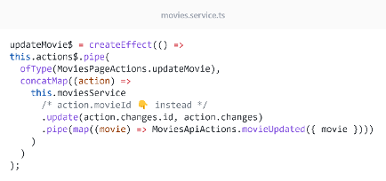

# Traditional vs. Reactive Angular
This repository contains two Angular applications that demonstrate the differences between Traditional and Reactive Angular development approaches. The applications are built using Angular 15 and aim to showcase how each approach impacts code quality, testability, and debuggability.

If you prefer to read the research paper in `pdf` format, you can click the cover image below to open it.

# Table of contents
- [Disclaimer](#disclaimer)
- [Summary](#summary)
- [Introduction](#introduction)
- [Research & Methods](#research--methods) 
- [Reactivity](#reactivity)
  - [Reactive Programming](#reactive-programming)
  - [Reactive Systems](#reactive-systems)
- [Traditional Angular](#traditional-angular)
  - [Reactive Programming](#reactive-programming-1)
  - [Reactive Systems](#reactive-systems-1)
- [Reactive Angular](#reactive-angular)
  - [NgRx](#ngrx)
  - [Reactive Programming](#reactive-programming-2)
  - [Reactive Systems](#reactive-systems-2)
- [Code Quality](#code-quality)
  - [Setup](#setup)
  - [Results](#results)
- [Testability](#testability)
  - [Testing](#testing)	
  - [Result](#result)
- [Debuggability](#debuggability)
- [Conclusion](#conclusion)
- [Sources](#sources)

# Disclaimer
This research was conducted using Angular 15. With the release of newer Angular versions, many reactive features are now available out-of-the-box that were not present at the time of this study. Consequently, this repository might not be relevant for everyone. For the most current practices, please refer to the latest Angular documentation.

# Summary
The research aimed to answer how Reactive Angular development compares to Traditional Angular development in terms of code quality, testability, and debuggability. Three sub-questions were answered to address the main question. But firstly, Reactivity was addressed in order to form a better understanding of the concept of Reactivity . Reactivity enables systems to respond efficiently to changing conditions or user requests, it utilises Reactive programming to combine functional and data-flow paradigms to model time-changing values and their dependencies.

This research has revealed that Reactive Angular involves more code but can lead to more maintainable, scalable, and robust applications in the long run. Furthermore, it has revealed that Reactive Angular requires a higher number of lines of code to write unit tests but provides benefits such as centralized state management and clear separation of concerns between building blocks. Finally, this research has revealed that the debuggability of both Traditional and Reactive Angular is very subjective and varies from developer to developer. 

From this research, the following can be concluded, Reactive and Traditional Angular offer different advantages and disadvantages in code quality, testability, and debuggability. Reactive Angular can be more maintainable and scalable in the long run but requires more code and might require a deeper understanding of Reactive programming concepts to debug. It also offers benefits like centralized state management, improving testability. Traditional Angular is simpler, making it easier to learn and test for some developers, but can lead to tightly coupled code. The choice depends on the project and the team's skills and preferences.

# Introduction 
Over the last couple of years, Angular has grown to become the second most popular front-end web application framework used by developers worldwide ([Stack Overflow, 2022](https://survey.stackoverflow.co/2022/)). As web application development becomes increasingly complex, it is important to explore the effectiveness of different approaches to ensure that developers have the necessary information to create high-quality applications efficiently.

This research aims to compare two approaches to developing applications in Angular, these being traditional and reactive programming. These will be compared in terms of code quality, testability and debuggability by creating the same application using both traditional and reactive programming practices. 

This research is organized as follows: the first section will explain how this research was conducted and what methods were used during the research. The second section will contain information about Reactivity, in order to gain a better understanding of what Reactivity is and how it can be achieved when developing applications. The third section will cover how traditional Angular adheres to Reactivity, in order to gain a better understanding of the way traditional Angular utilises and can improve in terms of Reactivity. The following sections will cover some of the results that were measured as a result of the comparison between Reactive and Traditional Angular on the basis of code quality, testability and debuggability. Finally, the final section will cover the conclusions that can be made in regard to how Reactive and Traditional Angular differ from each other in terms of code quality, testability and debuggability. By the end of this research the following research question will be answered: 

_"How can Reactive Angular Development be Compared to Traditional Angular Development in terms of Code Quality, Testability, and Debuggability?"_

# Research & Methods
This chapter of the research will contain information about how this research was conducted, what type of research was conducted per chapter, and which type of research methods were used while conducting the research. This is needed for this research in order to ensure that another person could also conduct this research and arrive at the same results. 

The sub-question related to Reactivity was answered by using desk research to gather information from different sources. These sources used in this chapter of the research include academic papers and manifestos. When looking for these resources the following search terms were used: _"What is RxJS?"_, _"What is reactive programming"_, and _"What is a reactive system?"_. Using these search terms, the resources in this research were found. The sub-questions related to traditional and reactive Angular were answered by also doing desk research, but instead directly reading into the software documentation of the frameworks that were used.

The sub-questions related to code quality and testability were answered by using empirical research to gather data through the creation of two applications and analysing that data to draw conclusions in other to answer the sub-questions. The application was created by using the information gathered from the previous sub-question as well as looking for samples online as to how Reactive applications are created. These samples were found by using terms such as _"NgRx"_, _"Reactive Angular"_, and _"NgRx Testing"_.

Finally, the sub-question related to debuggability was answered by using field research to gather the opinions from different developers, by making them debug two applications and answer questions related to the experience. This was done by inviting participants over to complete two coding challenges within the created applications. The applications contained errors within the code, meaning that the participants had to debug the application in order to find the error. After participating, the participants had to answer a question about their experience. This question was a very open question, in order for the results to vary between the participants.

# Reactivity
This chapter of the research will explore the paradigm of Reactive Programming, we will discuss the principles outlined in the Reactive Manifesto and examine how Reactive Programming differs from traditional programming paradigms. Through this exploration, we aim to gain a better understanding of how Reactive Programming can be used to build responsive, resilient, and elastic systems that can meet the demands of modern users and the internet. The insights gained in this chapter will lay the foundation for the next two chapters, where we will assess the adherence of both Traditional and Reactive Angular to Reactivity. 

By answering the question _"What is Reactivity?"_, this chapter will provide a theoretical basis that is necessary to understand the importance of Reactivity in building reliable software systems.

## Reactive Programming
Reactive programming is a paradigm that belongs to the taxonomy of programming paradigms, in order to gain a complete understanding of this paradigm, we first need to examine the relevant taxonomy. Within this taxonomy, the top paradigms are Imperative and Declarative programming. 

In Imperative programming, you use control flow commands like if and while to tell the program how to do things and modify its state with assignments. In contrast, in Declarative programming, you explicitly carry over computational results to accomplish tasks by instructing the program what to do, without relying on step-by-step instructions or assignments to modify the state.

Functional and Data-Flow paradigms are types of the Declarative programming paradigm. Functional programming evaluates functions and expressions recursively, replacing flow control statements, leading to a program's outcome resulting from its complete evaluation instead of its implicit state. Data-Flow programming represents programs as directed graphs, where nodes represent instructions and edges describe data flow.

Reactive programming combines abstractions from Functional and Data-Flow paradigms, utilising laziness, and 'pure' functions from Functional programming (Banken, Meijer, & Gousios, 2018) and a data-flow graph representation from Data-Flow programming to model time-changing values and their dependencies. The runtime environment interprets this graph and performs necessary computations to establish a deterministic system state ([Alabor, 2022](https://eprints.ost.ch/id/eprint/1031/1/alabor-debugging-support-for-reactive-programming-with-rxjs-master-thesis-v1.0.1.pdf))

## Reactive Systems
The Reactive Manifesto is a document that outlines the principles of reactive programming for building scalable and resilient reactive systems. The principles outlined in the manifesto provide a framework for building systems that are responsive, resilient, elastic, and message-driven. According to the Reactive Manifesto ([Bonér, Farley, Kuhn, & Thompson, 2014](https://www.reactivemanifesto.org/)), a reactive system should adhere to the following aspects:

### Responsive
Systems should respond in a timely manner to user requests, even under heavy load or failure conditions. This requires a design that can handle asynchronous and non-blocking I/O, and that can scale horizontally to handle increasing loads.

### Resilient
Systems should be able to handle failures gracefully and be able to recover quickly from failures without losing data or state. This requires a design that can isolate and contain failures, and that can use replication and redundancy to maintain availability.

### Elastic
Systems should be able to adapt to changing loads and be able to scale up and down dynamically as needed. This requires a design that can use auto-scaling and dynamic resource allocation to maintain performance under varying loads.

### Message-driven
Systems should use message-passing to enable loose coupling and location transparency between components. This requires a design that can use event-driven architectures and messaging systems to enable scalable and responsive communication between components.

----

Overall, the principles of the Reactive Manifesto emphasise the importance of building web applications that can handle the demands of modern users and the internet. By focusing on responsiveness, resilience, elasticity, and message-driven communication, developers can build systems that are scalable, reliable, and performant, even under extreme conditions.

To conclude this chapter, we can summarize and answer the opening question, _"What is Reactivity?"_ as follows:

Reactivity refers to the ability of a system or program to respond to changing conditions or user requests in a timely and efficient manner. It is achieved through the use of reactive programming, which combines abstractions from functional and data-flow paradigms to model time-changing values and their dependencies. Reactive systems adhere to the principles outlined in the Reactive Manifesto, which provides a framework for building scalable and resilient systems that are responsive, resilient, elastic, and message-driven. By focusing on these principles, developers can build systems that are able to handle the demands of modern users and the internet, even under extreme conditions.

# Traditional Angular
In this chapter of the research, we will analyse the official Angular documentation's 'Traditional' approach to developing applications and compare it with the reactive principles. The term 'Traditional' Angular is used in this research to refer to the conventional approach as documented by Angular. We aim to assess the extent to which the Traditional Angular approach adheres to the reactive principles. This information is crucial to help us develop a better understanding of the differences between traditional and reactive approaches in Angular development. This chapter is directly linked to the next chapter, where instead we will compare Reactive Angular with the reactive principles. A good understanding of traditional and reactive approaches is necessary to evaluate the differences between the two approaches. 

By answering the question _"How does Traditional Angular adhere to the reactive principles?"_, this chapter will provide a theoretical basis that is necessary to understand how Traditional Angular development utilises reactivity.

## Reactive Programming

Despite Angular's inherent reactivity through the use of RxJS in its core ([Angular & Google, 2023](https://www.npmjs.com/package/@angular-devkit/core?activeTab=dependencies)), the code samples provided in the Angular documentation often do not conform to the principles of reactive programming. Instead, traditional Angular development often relies on an Imperative style of programming. 

In this figure, an example is displayed from the official Angular documentation. Upon closer examination of this example, non-reactive aspects become apparent.

In this figure, the modification of the external state through assignment within the subscription to an Observable  can be seen on line 12. The use of assignments to modify external states is a characteristic of Imperative programming.

## Reactive Systems
Being a modern front-end application framework, traditional Angular itself already adheres to the Reactive System principles by leveraging the Angular framework's features and best practices. Angular offers a base set of features that offer developers the possibility to implement reactivity into their applications. 
Below examples are listed of how Traditional Angular adheres to the principles that were mentioned in [Reactive Systems](#reactive-systems).

### Responsive
Traditional Angular development can achieve responsiveness by taking advantage of Angular's change detection system and leveraging asynchronous and non-blocking I/O. Angular's change detection mechanism automatically updates the view when the application state changes, allowing for a highly responsive UI ([Angular, 2022](https://angular.io/guide/change-detection)). 

Angular's support for asynchronous operations, such as HTTP requests ([Angular, 2022](https://angular.io/guide/http)) and Observables, enables developers to handle user requests and other events in a timely manner, even under heavy load or failure conditions ([Angular, 2022](https://angular.io/guide/observables-in-angular))

### Resilient
Traditional Angular development can achieve resilience by following best practices for error handling and fault tolerance. Angular provides robust error-handling mechanisms that allow developers to detect and handle errors effectively, preventing the loss of data or state ([Angular, 2023](https://angular.io/guide/http-handle-request-errors))

### Elastic
Traditional Angular development can achieve elasticity by leveraging Angular's modular architecture ([Angular, 2022](https://angular.io/guide/architecture-modules)) and component-based approach. Developers can break down the application into smaller, more manageable pieces and reuse components as needed ([Angular, 2022](https://angular.io/guide/component-overview)), allowing the application to adapt to changing loads and scale up or down dynamically as needed.

### Message-driven
Traditional Angular development can follow the principles of a message-driven architecture by utilising RxJS, a reactive programming library. RxJS allows developers to build applications that are event-driven and reactive, enabling them to communicate between components in a scalable and responsive way ([Angular, 2022](https://angular.io/guide/rx-library)).

----

To conclude this chapter, we can summarize and answer the opening question, _"How does Traditional Angular adhere to the reactive principles?"_ as follows:

Traditional Angular leverages the framework's features to adhere to the Reactive System principles, including responsiveness, resilience, elasticity, and message-driven communication. Angular's change detection system, support for asynchronous and non-blocking I/O, error-handling mechanisms, fault tolerance best practices, and RxJS allow for traditional Angular development to achieve these principles. However, the code samples in Angular documentation often rely on an Imperative style of programming rather than reactive programming.

# Reactive Angular
In this chapter of the research, we will explore the Reactive approach to building Angular applications and analyse its adherence to the principles of Reactive Systems by comparing it with the reactive principles. We will also compare the Reactive Angular approach with the conventional, or 'Traditional,' approach to building Angular applications. Specifically, we will focus on building Reactive Angular applications using NgRx, which extends the reactive programming capabilities of the Angular framework by providing a centralized approach to managing application state and communication between components. Throughout this chapter, we will analyse the specific features and practices of Reactive Angular with NgRx that support its adherence to the principles of Reactive Systems. 

By answering the question _"How does Reactive Angular adhere to the reactive principles?"_, this chapter will provide a theoretical basis that is necessary to understand the differences between Traditional and Reactive approaches in Angular development.

## NgRx
NgRx is a framework designed for building reactive applications in Angular. It provides several libraries that facilitate different aspects of application development, including managing both global and local states, isolating side effects to promote a cleaner component architecture, managing entity collections, integrating with the Angular Router, and enhancing developer tooling for various types of applications. 

### Store

NgRx Store is ideal for applications with multiple data sources and complex interactions. However, it encourages the use of many files and is not the shortest or quickest way to write code. The architecture that is inspired by Redux promotes immutability and performance, encapsulation, and serializability. NgRx Store also allows for the isolation of external resource interactions and business logic from the UI components ([NgRx, 2023](https://ngrx.io/guide/store/why)).
In this figure, the NgRx Store architecture is displayed, this architecture can be implemented by implementing the following building blocks into the architecture of the application.

#### Action
Actions are key components in NgRx that represent events in the application, such as user interactions, network requests, and device API interactions ([NgRx, 2023](https://ngrx.io/guide/store/actions)).

#### Reducer
Reducers handle transitions between states in NgRx by processing actions. They are pure functions without side effects, taking the latest action and current state to produce a new state ([NgRx, 2023](https://ngrx.io/guide/store/reducers)).

#### Selector
Selectors are pure functions that obtain slices of store state and offer features like portability, memoization, composition, testability, and type safety. They can be optimized by keeping track of the latest arguments to provide performance benefits through memoization ([NgRx, 2023](https://ngrx.io/guide/store/selectors)).

#### Effect
Effects in NgRx provide a way to handle external interactions such as network requests and isolate them from components. They use streams to provide new sources of actions to reduce state ([NgRx, 2023](https://ngrx.io/guide/effects)).

## Reactive Programming

Reactive Programming in NgRx can be achieved by utilising the building blocks and directives provided by NgRx. By using its directives and way of creating cleaner component architecture, Angular applications become more reactive. This figure showcases an example of the usage of [Selectors](#selector). Upon closer examination of this example, reactive aspects become apparent. As seen, we no longer need to modify the external state through assignment within the subscription to an Observable. Instead of calling our service and assigning the values to a variable within the subscription, Selectors can be used to retrieve the state from the Store. With this, the code has become more declarative as there is no more need to manually set external state.

## Reactive Systems
Traditional Angular offers a robust set of features and best practices for building reactive front-end applications. However, by leveraging NgRx, Reactive Angular takes reactivity to the next level by enabling developers to build applications that are even more responsive, resilient, and scalable.

Below examples are listed of how Reactive Angular adheres to the principles that were mentioned in [Reactive Systems](#reactive-systems) and compares it to traditional Angular to demonstrate the benefits of utilising NgRx in web application development.

### Responsive
Reactive Angular achieves responsiveness by leveraging reactive programming and state management with RxJS and NgRx. NgRx provides a centralized store that manages the state of the entire application, which allows for efficient and effective change detection. Additionally, NgRx's use of the Redux pattern enables developers to handle user requests and other events in a timely manner, even under heavy load or failure conditions. In comparison, Traditional Angular also uses RxJS to achieve responsiveness but does not provide a centralised store or enforce the Redux pattern.

### Resilient
Reactive Angular achieves resilience by providing a clear separation of concerns between presentation and business logic. NgRx's use of the Redux pattern allows for easy error handling and fault tolerance, as developers can easily roll back to previous states in case of errors or failures. Additionally, NgRx's use of immutable data structures ensures that the application state remains consistent and prevents the loss of data or state. In comparison, Traditional Angular also provides error-handling mechanisms but does not enforce immutability or separation of concerns to the same extent as NgRx.

### Elastic
Reactive Angular achieves elasticity by providing a modular architecture and component-based approach that can scale up or down dynamically as needed. NgRx's use of a centralized store allows developers to break down the application into smaller, more manageable pieces and reuse components as needed. Additionally, NgRx's support for lazy loading and code splitting enables the application to adapt to changing loads and reduce startup times. In comparison, Traditional Angular also provides a modular architecture and component-based approach but does not enforce the same level of centralization or provide the same level of support for lazy loading and code splitting as NgRx.

### Message-driven
Reactive Angular using NgRx adheres to the principles of a message-driven architecture by utilizing [Effects](#effect) in combination with [Actions](#action), which enable communication between components and side effects to be handled in a predictable and scalable way. Effects also enable developers to implement business logic that is completely decoupled from the presentation layer, which allows for a highly scalable and responsive architecture. In comparison, Traditional Angular also provides support for message-driven architectures using RxJS but does not provide the same level of centralization or enforce the same level of decoupling as NgRx.

---- 

Overall, Reactive Angular using NgRx provides a more robust and scalable approach to building Reactive systems, with centralised state management, clear separation of concerns, support for lazy loading and code splitting, and a more enforceable and predictable message-driven architecture.

To conclude this chapter, we can summarize and answer the opening question, _"How does Reactive Angular adhere to the reactive principles?"_ as follows:

Reactive Angular uses NgRx, a framework for building reactive Angular apps that provides libraries for managing states, side effects, entity collections, routing, and developer tooling. NgRx Store, inspired by Redux, promotes immutability, performance, and isolation of external resources and business logic from UI components. The building blocks are Actions, Reducers, Selectors, Effects, and Components. By leveraging RxJS and NgRx, Reactive Angular enables developers to build even more responsive, resilient, and scalable apps through centralized state management, Redux pattern, modular architecture, component-based approach, lazy loading, code splitting, and Effects combined with Actions.

# Code Quality
In this chapter of the research, we will analyse the differences between Reactive and Traditional Angular development in terms of size and cyclomatic/cognitive complexity. By analysing the two applications that have been assessed using SonarQube, we will provide a comprehensive overview of the differences between Reactive and Traditional Angular development in terms of these key metrics.

By answering the question _"How do Reactive and Traditional Angular development compare in terms of size and cyclomatic/cognitive complexity?"_, this chapter will provide a better understanding of the trade-offs between the two approaches and will provide valuable insights for developers looking to choose the most suitable approach for their Angular projects.

## Setup
Some setup was involved before successfully being able to perform a SonarQube scan on the projects. First, sonar-scanner  needs to be installed, then a properties file needs to be created in the root directory of the Angular project. This file contains all of the necessary information needed for the project to connect with the SonarQube server. After this a script needs to be added to the project, after which the sonar scanner can be called through the script. This command analyses the code and uploads the results to the SonarQube server. Before being able to analyse the projects, a SonarQube instance needs to be running, this can be done by using Docker.

## Results
Once the analyses were complete, the code quality metrics were present within the dashboard for each of the project. 

### Size
| Metric        | Traditional | Reactive |
|---------------|-------------|----------|
| Lines of code | 425         | 619      |
| Functions     | 28          | 52       |
| Classes       | 7           | 9        |
| Files         | 22          | 29       |

#### Lines of code
The reactive application has 45% more lines of code (619 vs 425) than the traditional one. This is because the reactive approach often involves more boilerplate code to handle state management, data flow, and asynchronous operations.

#### Functions
The reactive application has 85.7% more functions (52 vs 28) than the traditional one. This is because the reactive approach encourages the use of functional programming concepts such as pure functions, higher-order functions, and function composition to handle complex logic and data transformations.

#### Classes
The reactive application has 28.6% more classes (9 vs 7) than the traditional one. This is because the reactive approach often involves creating more classes to encapsulate state and behaviour, which can help improve modularity and reusability of code.

#### Files
The reactive application has 31.8% more files (29 vs 22) than the traditional one. This is because the reactive approach often involves separating code into smaller, more focused files to improve organization and maintainability.

----

Overall, these differences in lines of code, functions, classes, and files between the traditional and reactive applications reflect the different approaches and paradigms used in each one. While the reactive approach may require more initial setup and code, it can lead to more maintainable, scalable, and robust applications in the long run.

### Complexity
| Metric                | Traditional | Reactive |
|-----------------------|-------------|----------|
| Cyclomatic Complexity | 37          | 63       |
| Cognitive Complexity  | 5           | 7        |

#### Cyclomatic Complexity
The reactive application has a 70.27% higher cyclomatic complexity (63 vs 37) than the traditional one. This is because the reactive approach introduces several new building blocks such as Reducers and Effects that contain a large amount of cyclomatic complexity. Because of these building blocks, our component has decreased in cyclomatic complexity by 50% (10 vs 15).

#### Cognitive Complexity
The reactive application has a 40.0% higher cognitive complexity (7 vs 5) than the traditional one. This is because the reactive approach introduced the Reducer that contains some amount of cognitive complexity.

----

Overall, these differences in complexity between the traditional and reactive applications reflect the different approaches and paradigms used in each one. While the reactive approach may require more complexity that is being introduced through its building blocks, it can lead to more maintainable, scalable, and robust applications in the long run.

----

To conclude this chapter, we can summarize and answer the opening question, _"How do Reactive and Traditional Angular development compare in terms of size and cyclomatic/cognitive complexity?"_ as follows:

The reactive approach generally involves more code, including more lines of code, functions, classes, and files than the traditional approach due to its emphasis on state management, data flow, and asynchronous operations. However, the reactive approach can lead to more maintainable, scalable, and robust applications in the long run. In terms of complexity, the reactive approach introduces several new building blocks such as Reducers and Effects that increase cyclomatic and cognitive complexity but can also decrease complexity in the overall component. Despite the differences in size and complexity, the reactive approach provides significant benefits to developers seeking to build complex applications.

# Testability
In this chapter of the research, we will compare the testability of Reactive and Traditional Angular development by analysing the lines of code needed to write a unit test for each approach. Throughout this chapter, we will examine the benefits and drawbacks of each approach in terms of testability.

By answering the question _"How does the testability of Reactive and Traditional Angular development compare in terms of lines of code needed to write a unit test?"_, this chapter will provide a deeper understanding of the differences between Reactive and Traditional Angular development in terms of testability.

## Testing
As for the testing, for the two applications the same tests have been created in order to ensure a reliable result. For this the same methods in each of the components have been tested, both in the Traditional as well as in the Reactive application. For this the initial loading of items and the selection of items methods have been tested.

## Result
|                 | Traditional | Reactive |
|-----------------------|-------------|----------|
| Lines of code | 86          | 120       |
| Cognitive Complexity  | 5           | 7        |

The reactive application has 39.53% more lines of code (120 vs 86) than the traditional one. This is because the reactive approach introduces additional code for setting up and managing the store, as well as for defining and dispatching actions. By only setting up the additional building blocks within the test, the test has already increased in size by 9 lines of code. Because of the need for defining and dispatching of the actions, individual tests can already increase in size by 8 lines of code, as seen in this figure. Despite the increase in size, NgRx provides benefits such as centralized state management, and clear separation of concerns between the building blocks. Therefore, improved testability can be achieved because these features make it easier to write and maintain tests, as it provides clear separation between UI and state management and allows for deterministic testing of the state changes triggered by actions. In contrast, testing non-NgRx apps can be more challenging, as the state can be spread across multiple components and services, making it harder to isolate and test specific parts of the application.

----

To conclude this chapter, we can summarize and answer the opening question, _"How does the testability of Reactive and Traditional Angular development compare in terms of lines of code needed to write a unit test?"_, as follows:

The Reactive approach in Angular development requires a higher number of lines of code to write unit tests when compared to traditional Angular. The reactive approach introduces additional code for setting up and managing the store, defining, and dispatching actions, and creating building blocks within the test, resulting in a 39.53% increase in lines of code. However, despite the increase in size, NgRx provides benefits such as centralized state management and clear separation of concerns between building blocks, which improves testability. In contrast, testing non-NgRx apps can be more challenging due to the state being spread across multiple components and services, making it harder to isolate and test specific parts of the application

# Debuggability
In this chapter of the research, we will analyse the debuggability of Reactive and Traditional Angular development by asking participants to debug both a Reactive and Traditional Angular application and fix the issue that is present within the application. We will examine each participant's approach and their opinions on traditional and reactive Angular development for debugging. This information is crucial to help us develop a better understanding of the differences between traditional and reactive approaches in Angular development, specifically in terms of debuggability.

By answering the question _"How does the debuggability of reactive and traditional Angular development compare based on developer opinion?"_, this chapter will provide insight into the experiences of developers with different levels of experience and expertise in Angular and NgRx. This knowledge will be useful in evaluating the strengths and weaknesses of each approach and ultimately in helping developers choose the best approach for their particular project.

The Debuggability challenge consisted of four participants, two of whom had 6 months of experience in NgRx and Angular. One participant had 1 year of experience in Traditional Angular and 0.5 years in NgRx, and the other participant had no experience in NgRx but 1 years of experience in Angular. The participants had 25 minutes for each of the problems. Afterwards each participant was asked the question: 

_"In your opinion, which is easier to debug: reactive or traditional Angular development? Why?"_

The challenge involved two issues that needed to be fixed in an Angular application. The first issue was related to the incorrect use of an operator, and the second issue was related to the wrong use of a parameter within the function. 

The below two figures are the challenges that were shown to the participants. 

  
  

The first participant had 1 year of experience in Traditional Angular and 0.5 years of experience in NgRx. He used manual print debugging from the beginning. Unfortunately, he was unable to find the first issue within the given time. For the second issue, he used manual print debugging and was able to find the issue and fix it within the given time minutes. He has no preference between traditional and reactive debugging as both have their own their strengths and weaknesses. But he tends to find traditional Angular development more difficult to debug due to its tendency to be more error-prone and require more manual intervention.

The second participant had 6 months of experience in NgRx and Angular. She used manual print debugging from the beginning and was able to find and fix the first issue within 8 minutes of time. For the second issue, she was unable to find issue within the given minutes. She prefers traditional Angular development for debugging as it allows for more straightforward and easier to understand code. She finds reactive Angular development more difficult to debug due to its verbosity and need for more boilerplate code.

The third participant had 6 months of experience in NgRx and Angular. He also used manual print debugging from the beginning and found the first issue within 15 minutes of time. For the second issue, he was unable to find the issue within the given time. He finds reactive Angular development more difficult to debug due to its requirement of a deeper understanding of reactive programming concepts.

The fourth participant had no experience in NgRx but 1 years of experience in Angular. He used manual print debugging from the beginning and found the first issue within 20 minutes of time. He was also unable to find the second issue within the given time. He has no clear preference between reactive and traditional Angular development for debugging. He finds that his lack of experience with NgRx makes reactive Angular development more challenging to debug but is willing to learn and improve his skills in this area. 

----

To conclude this chapter, we can summarize and answer the opening question, _"How does the debuggability of reactive and traditional Angular development compare based on developer opinion?"_, as follows:

The debuggability of Reactive and Traditional Angular development is subjective and varies from developer to developer. Some participants found traditional Angular development more straightforward and less error-prone, while others found Reactive Angular development more efficient and easier to debug complex data flows. However, it seems that Reactive Angular development requires a deeper understanding of Reactive programming concepts, which can make it more difficult to debug for some developers. Overall, there is no clear consensus on which approach is better for debugging Angular applications, as the data we collected is based on a small sample group. Hence, the results we conveyed in this paper cannot represent the debuggability of both Traditional and Reactive Angular applications.

# Conclusion
This research set out to find an answer to the following question: _"How can Reactive Angular Development be Compared to Traditional Angular Development in terms of Code Quality, Testability, and Debuggability?"_. An answer to this question has been found by answering the three sub-questions related to this question. Before answering the main question, first, we will conclude the findings for the three sub-questions. 

_"How do Reactive and Traditional Angular development compare in terms of size and cyclomatic/cognitive complexity?"_, was the first sub-question related to the main question. This research has found that the Reactive Angular generally involves more code, including more lines of code, functions, classes, and files than Traditional Angular due to its emphasis on state management, data flow, and asynchronous operations. However, Reactive Angular can lead to more maintainable, scalable, and robust applications in the long run. In terms of complexity, Reactive Angular introduces several new building blocks such as Reducers and Effects that increase cyclomatic and cognitive complexity but can also decrease complexity in the overall component. Despite the differences in size and complexity, the reactive approach provides significant benefits to developers seeking to build complex applications.

_"How does the testability of Reactive and Traditional Angular development compare in terms of lines of code needed to write a unit test?"_, was the second sub-question related to the main question. This research has found that Reactive Angular requires a higher number of lines of code to write unit tests when compared to Traditional Angular. Reactive Angular introduces additional code for setting up and managing the store, defining, and dispatching actions, and creating building blocks within the test, resulting in a 39.53% increase in lines of code. However, despite the increase in size, Reactive Angular provides benefits such as centralized state management and clear separation of concerns between building blocks, which improves testability. In contrast, testing Traditional Angular apps can be more challenging due to the state being spread across multiple components and services, making it harder to isolate and test specific parts of the application. 

_"How does the debuggability of reactive and traditional Angular development compare based on developer opinion?"_, was the third and final sub-question related to the main question. This research has found that the debuggability of Reactive and Traditional Angular development is subjective and varies from developer to developer. Some participants found traditional Angular development more straightforward and less error-prone, while others found Reactive Angular development more efficient and easier to debug complex data flows. However, it seems that Reactive Angular development requires a deeper understanding of Reactive programming concepts, which can make it more difficult to debug for some developers. Overall, there is no clear consensus on which approach is better for debugging Angular applications, as the data we collected is based on a small sample group. Hence, the results we conveyed in this paper cannot represent the debuggability of both Traditional and Reactive Angular applications.

Now that an answer has been found for both sub-questions, the main question can be answered. Reactive Angular and Traditional Angular have their respective advantages and disadvantages in terms of code quality, testability, and debuggability. Reactive Angular generally involves more code and introduces new building blocks, but it can lead to more maintainable, scalable, and robust applications in the long run. While Reactive Angular requires a higher number of lines of code to write unit tests, it provides benefits such as centralized state management and clear separation of concerns between building blocks, which improves testability. The debuggability of both approaches is subjective and varies from developer to developer. Therefore, it is crucial to consider the project requirements and the team's skills and preferences when choosing between Reactive and Traditional Angular development.

# Sources
Angular & Google. (2023, April 12). @angular-devkit/core dependencies. Retrieved from npm.js: https://www.npmjs.com/package/@angular-devkit/core?activeTab=dependencies

NgRx. (2023). @ngrx/effects. Retrieved from NgRx.io: https://ngrx.io/guide/effects

NgRx. (2023). Actions. Retrieved from NgRx.io: https://ngrx.io/guide/store/actions

Angular. (2022, May 4). Angular change detection and runtime optimization. Retrieved from Angular.io: https://angular.io/guide/change-detection

Angular. (2022, February 28). Angular components overview. Retrieved from Angular.io: https://angular.io/guide/component-overview

(2023).Code snippet showing the Reactive way of creating Angular Components. Adapted from NgRx. NgRx. Retrieved from https://ngrx.io/guide/store/selectors#using-store-without-type-generic

(2022).Code snippet showing the Traditional way of creating Angular Components. Adapted from Angular. Angular. Retrieved from https://angular.io/tutorial/tour-of-heroes/toh-pt4#final-code-review

Angular. (2022, February 28). Communicating with backend services using HTTP. Retrieved from Angular.io: https://angular.io/guide/http

(2023).Diagram showing the overall general flow of application state in NgRx. Adapted from NgRx. NgRx. Retrieved from https://ngrx.io/generated/images/guide/store/state-management-lifecycle.png

Angular. (2023, February 27). HTTP client - Handle request errors. Retrieved from Angular.io: https://angular.io/guide/http-handle-request-errors

Angular. (2022, February 28). Introduction to modules. Retrieved from Angular.io: https://angular.io/guide/architecture-modules

Angular. (2022, February 28). Observables in Angular. Retrieved from Angular.io: https://angular.io/guide/observables-in-angular

NgRx. (2023). Reducers. Retrieved from NgRx.io: https://ngrx.io/guide/store/reducers

NgRx. (2023). Selectors. Retrieved from NgRx.io: https://ngrx.io/guide/store/selectors

Stack Overflow. (2022). Stack Overflow Developer Survey 2022. Retrieved April 8, 2023, from Stack Overflow Annual Developer Survey: https://survey.stackoverflow.co/2022/

Angular. (2022, February 28). The RxJS library. Retrieved from Angular.io: https://angular.io/guide/rx-library

NgRx. (2023). Why use Store? Retrieved April 13, 2023, from NgRx: https://ngrx.io/guide/store/why
Alabor, M. (2022, January 15). Debugging Support for Reactive Programming with RxJS.

Banken, H., Meijer, E., & Gousios, G. (2018). Debugging Data Flows in Reactive Programs. ICSE 2018 Association for Computing Machinery (ACM).

Bonér, J., Farley, D., Kuhn, R., & Thompson, M. (2014, September 16). The Reactive Manifesto. Retrieved April 8, 2023, from The Reactive Manifesto: https://www.reactivemanifesto.org/